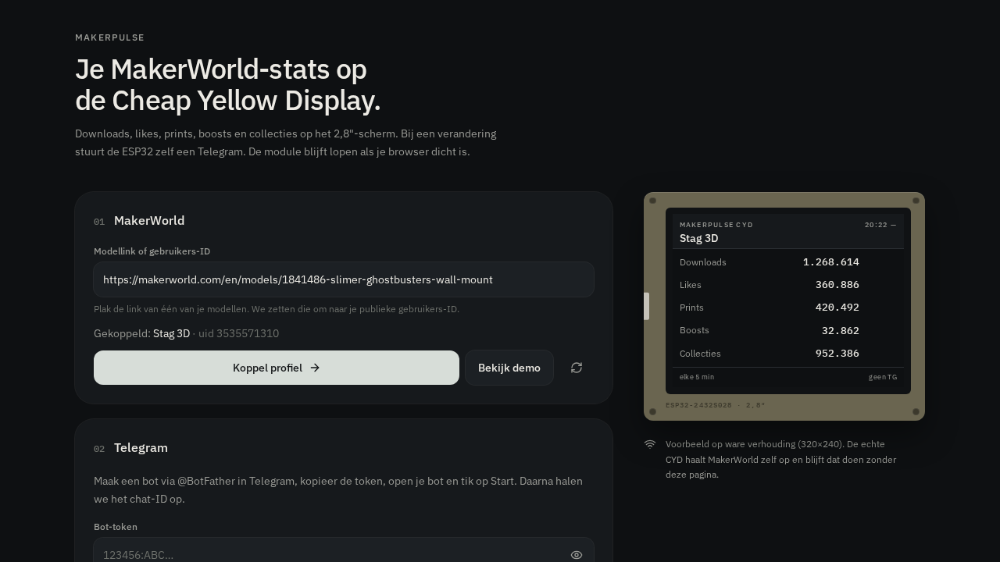

# MakerPulse


MakerWorld statistics on a Cheap Yellow Display ([ESP32-2432S028](https://github.com/witnessmenow/ESP32-Cheap-Yellow-Display)).



Downloads, likes, prints, boosts, collections and comments — when a value changes, the module sends a Telegram message with the model title. **Comments is the total across all of your published models**, not just the featured one.

After flashing, the CYD talks to MakerWorld on its own. You can close the browser.

**Firmware:** [`2026.09.12a`](firmware/MakerPulse_CYD.ino) · **License:** [MIT](LICENSE)

---

## (different project) Also see this self-hosted Docker container: web dashboard (Docker)

Prefer charts, history per model, and a period picker in the browser? That is a separate project: **[MakerPulse](https://github.com/leon199219/makerpulse)** — self-hosted Docker analytics.

[](https://github.com/leon199219/makerpulse)


The CYD firmware and the dashboard are independent. Run the screen, the web UI, or both.

---

## This project (CYD): What it does

- Six entities on the 2.8" screen (240×320)
- Telegram on change
- Each affected model's title in the message, not only the pinned one
- MQTT → Home Assistant display backlight (on/off + brightness 0–255)
- HTTP endpoint `/light` if you do not want a broker
- Incomplete comment counts are discarded (`found/total` at the bottom of the screen)

No MakerWorld login, no third-party cloud. Public profile and model data only.

## Install with Arduino IDE

### Directly from this repo

1. Clone or download the repo.
2. Copy [`firmware/config.h.example`](firmware/config.h.example) → `firmware/config.h`.
3. Fill in the Wi-Fi name, password and `MAKERWORLD_UID` (every line has a comment).
4. Open `firmware/MakerPulse_CYD.ino` in Arduino IDE 2.
5. Board **ESP32 Dev Module**, flash **4MB**, partition **Default 4MB with spiffs**.
6. Libraries: **LovyanGFX**, **ArduinoJson 7**, **PubSubClient**.
7. Put the folder on a path with no spaces, e.g. `C:\\MakerPulse_CYD\\`.

Full steps, Telegram, MQTT and troubleshooting: [firmware/README.md](firmware/README.md).

## Hardware

| | |
| --- | --- |
| Board | ESP32-2432S028 (CYD 2.8", 240×320) |
| Cable | USB that carries data (not charge-only) |
| Network | 2.4 GHz Wi-Fi (not 5 GHz) |
| Optional | Telegram bot, MQTT / Home Assistant |

Newer USB-C CYD: enable **newer CYD (USB-C)** in the configurator, or set `CYD_PANEL_ST7789 1` in `config.h`.

## Telegram

1. [@BotFather](https://t.me/BotFather) → `/newbot` → token.
2. Open your bot and tap **Start**.
3. Put the chat ID in the configurator or in `config.h`.
4. Send a test message before you flash.

The CYD stores the last values in flash. Only a real delta triggers a message.

## Home Assistant

After flashing, the IP is shown at the bottom-right of the screen (`makerpulse-cyd.local`).

**MQTT (recommended):** Mosquitto in HA, host/user/password in MakerPulse, flash again. The light **MakerPulse display** then appears under MQTT devices.

**HTTP:** `POST http://makerpulse-cyd.local/light` with `{"state":"ON","brightness":255}`. Details in [firmware/README.md](firmware/README.md).

## Optional: firmware configurator (Docker)

The GUI is **not** a GitHub Pages site: it needs a server (MakerWorld + zip). This is **not** the [analytics dashboard](https://github.com/leon199219/makerpulse).

This public repo is the **Arduino firmware**. The Node configurator lives in `makerpulse-docker.zip`, downloaded from the configurator. Unzip and:

```bash
docker compose up -d --build
```

Port 3080, no database, no login. Guide: [DOCKER.md](DOCKER.md).

## Layout

```
firmware/MakerPulse_CYD.ino   sketch (keep as one file)
firmware/mp_types.h           types for Arduino prototypes
firmware/config.h.example     copy to config.h — never commit
firmware/README.md            flashing, Telegram, MQTT, troubleshooting
docs/                         screenshots
LICENSE                       MIT
SECURITY.md                   what never to publish
```

`config.h` is in [`.gitignore`](.gitignore). Keep `mp_types.h` next to the `.ino`.

## Do not publish

See [SECURITY.md](SECURITY.md).

- no `config.h` with Wi-Fi / Telegram token / MQTT password
- no personal `MakerPulse_CYD.zip`
- no internal Home Assistant IP or compose file with secrets

## License

[MIT](LICENSE) © 2026 [leon199219](https://github.com/leon199219)
