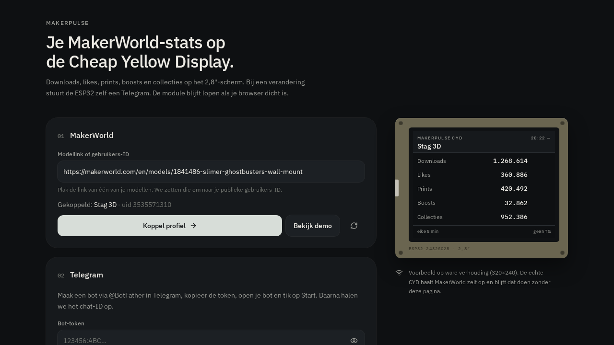

# MakerPulse


MakerWorld statistics on a Cheap Yellow Display ([ESP32-2432S028](https://github.com/witnessmenow/ESP32-Cheap-Yellow-Display)).



Downloads, likes, prints, boosts, collections and comments — when a value changes, the module sends a Telegram message with the model title. **Comments is the total across all of your published models**, not just the featured one.

After flashing, the CYD talks to MakerWorld on its own. You can close the browser.

**Firmware:** [`2026.10.01a`](firmware/MakerPulse_CYD.ino) · **License:** [MIT](LICENSE)

---

## (different project) Also see this self-hosted Docker container: web dashboard (Docker)

Prefer charts, history per model, and a period picker in the browser? That is a separate project: **[MakerPulse](https://github.com/leon199219/makerpulse)** — self-hosted Docker analytics.

[](https://github.com/leon199219/makerpulse)


The CYD firmware and the dashboard are independent. Run the screen, the web UI, or both.

---

## This project (CYD): What it does

- Six entities on the 2.8" screen (240×320)
- Telegram on change
- Each affected model's title in the message, not only the pinned one
- MQTT → Home Assistant display backlight (on/off + brightness 0–255) and six sensors (downloads, likes, prints, boosts, collections, comments)
- HTTP endpoint `/light` if you do not want a broker
- Incomplete comment counts are discarded (`found/total` at the bottom of the screen)

No MakerWorld login, no third-party cloud. Public profile and model data only.

## Install with Arduino IDE

### Directly from this repo

1. Clone or download the repo.
2. Copy [`firmware/config.h.example`](firmware/config.h.example) → `firmware/config.h`.
3. Fill in the Wi-Fi name, password and `MAKERWORLD_UID` (see [Find your MakerWorld UID](#find-your-makerworld-uid)).
4. Open `firmware/MakerPulse_CYD.ino` in Arduino IDE 2.
5. Board **ESP32 Dev Module**, flash **4MB**, partition **Default 4MB with spiffs**.
6. Libraries: **LovyanGFX**, **ArduinoJson 7**, **PubSubClient**.
7. Put the folder on a path with no spaces, e.g. `C:\\MakerPulse_CYD\\`.

Full steps, Telegram, MQTT and troubleshooting: [firmware/README.md](firmware/README.md).

## Find your MakerWorld UID

`MAKERWORLD_UID` is the numeric account number (~10 digits). Not `@YourName`, not a model id, not `#profileId-…`. Use **only the digits**, without `@` and without `user_`.

### Fastest method (recommended)

1. Go to [makerworld.com](https://makerworld.com) and sign in.
2. Press **F12** → **Console** tab.
3. Paste this and press Enter:

```javascript
fetch("/api/v1/design-user-service/my/preference")
  .then(r => r.json())
  .then(d => { console.log("UID:", d.uid); copy(String(d.uid)); });
```

Your UID appears in the console and is copied. Paste that number into `MAKERWORLD_UID`.

That `uid` field is the numeric account number that tracking projects expect (about 10 digits).

### Faster still, without the API

- Handle looks like `@user_1298228011`? Then `1298228011` is usually already your UID.
- Avatar: open your profile, right-click the photo → **Copy image address**. The URL often contains `/avatar/4044076662/` — that number is your UID.
- Open one of **your own** models. In the page source or the Network tab you will find `designCreator.uid`.

```c
#define MAKERWORLD_UID 1298228011UL
#define MAKER_NAME "Maker"
```

`MAKER_NAME` is only the label on the screen. Details: [firmware/README.md](firmware/README.md#4-makerworld-account-makerworld_uid).

## Hardware

| | |
| --- | --- |
| Board | ESP32-2432S028 (CYD 2.8", 240×320) |
| Cable | USB that carries data (not charge-only) |
| Network | 2.4 GHz Wi-Fi (not 5 GHz) |
| Optional | Telegram bot, MQTT / Home Assistant |

Newer USB-C CYD: enable **newer CYD (USB-C)** in the configurator, or set `CYD_PANEL_ST7789 1` in `config.h`.

## Telegram

1. [@BotFather](https://t.me/BotFather) → `/newbot` → token.
2. Open your bot and tap **Start**.
3. Put the chat ID in the configurator or in `config.h`.
4. Send a test message before you flash.

`TELEGRAM_INTERVAL_SEC` chooses the summary period: `0` (each check), `3600` (1 hour), `21600` (6 hours) or `86400` (24 hours). Each option is one summary of that period for every statistic you left on. A quiet period sends nothing. The screen still refreshes every 2, 5, 10 or 15 minutes (`POLL_INTERVAL_SEC`).

## Home Assistant (MQTT)

MQTT is optional. Leave `MQTT_HOST` empty in `config.h` and the display and Telegram still work. Install stays in the Arduino IDE — there is no Docker step for the CYD.

| Define | Meaning |
| --- | --- |
| `MQTT_HOST` | Mosquitto IP or hostname. Empty = MQTT off. |
| `MQTT_PORT` | Default `1883`. |
| `MQTT_USER` | Broker user, or empty. |
| `MQTT_PASS` | Broker password, or empty. |

1. Install the **Mosquitto broker** add-on. Discovery prefix `homeassistant` stays on.
2. Fill in the defines and flash again with the Arduino IDE.
3. Settings → Devices & services → MQTT. Device **MakerPulse CYD** appears.

| Entity | What it is |
| --- | --- |
| Light **MakerPulse scherm** | Screen on/off and brightness 0–255 |
| Sensor **Downloads** | Published-model downloads |
| Sensor **Likes** | Likes |
| Sensor **Prints** | Prints |
| Sensor **Boosts** | Boosts |
| Sensor **Collecties** | Collections |
| Sensor **Comments** | Reviews & Ratings on every published model, summed |

Sensors update after each successful MakerWorld check, and again when the broker reconnects. Topic: `makerpulse/<mac>/stats`.

HTTP (`POST http://makerpulse-cyd.local/light`) only controls the backlight. The six statistics are MQTT-only. Full steps: [firmware/README.md](firmware/README.md#8-home-assistant--mqtt-options).

## Layout

```
firmware/MakerPulse_CYD.ino   sketch (keep as one file)
firmware/mp_types.h           types for Arduino prototypes
firmware/config.h.example     copy to config.h — never commit
firmware/README.md            flashing, Telegram, MQTT, troubleshooting
docs/                         screenshots
LICENSE                       MIT
SECURITY.md                   what never to publish
```

`config.h` is in [`.gitignore`](.gitignore). Keep `mp_types.h` next to the `.ino`.

## Do not publish

See [SECURITY.md](SECURITY.md).

- no `config.h` with Wi-Fi / Telegram token / MQTT password
- no personal `MakerPulse_CYD.zip`
- no internal Home Assistant IP or compose file with secrets

## License

[MIT](LICENSE) © 2026 [leon199219](https://github.com/leon199219)
